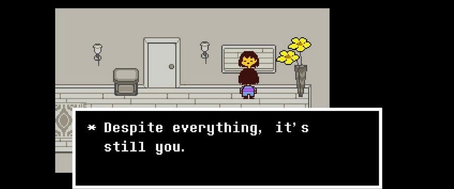

That really is the question that can sum up a great portion of our college expereinces. "Who am I?".

Finding yourself and recognizing growth can be difficult at times, especially when so much around us is changing faster than we can process. When I look at myself, there is so much I see and so much that I want to become.

During my freshman year, I wrote:

> I am a computer nerd that loves using the skills I learn to solve practical problems.  I enjoy camping and taking pictures of the outdoors.  I do my best to make healthy personal connections with those I meet and hear their stories.  I am ambitious and organized in my work.

The person that wrote that statement had no solid direction after graduation. He knew he just wanted to solve problems and help those around him.

He did not design a complex [assembler](/projects/assembler) to expand his problem solving skills. In fact, most of the techniques he would eventually used were incomprehensible at this time.

He did not understand just how powerful [automation tools](/posts/CognitiveAutomation) could be and how they unlocked a new type of problem solving.

He did not know how meaningful it can be to take on an internship at a consulting firm where the problems and people matter.

# Growth

How much has that simple "I am..." statement changed over the past four years? To be honest, not much. Fundamentally, I am still the same person that loves solving problems and connecting with people. But I will say that I understand more about my capabilities and what pushes me to do my absolute best. Many of my most difficult challenges gave me new appreciations for my interests.

I also think it is important to recognize my growth as a person outside of my field. I still believe that it is important to make personal connections with people. However, I learned how important it is to be empathetic and compassionate to those around me. Everyone has their own life with their own struggles. The least we should do is understand and support each other to the best of our abilities.

# I am...

When I look at everything I have gone through over these past four years, I am reminded of this simple line from Undertale by Toby Fox.

> "Despite everything, it's still you." - Toby Fox.

In context of the game, there is a mirror close to the beginning of the game that reads "It's you!". As you travel through the world, you make lots of new friends and help those in need. The nicer you are, the harder the battles are for you. In one of the final sections of the game, you find an almost identical house with the same mirror with that simple line. You (as the character) grew so much it can be hard to remember how you started your journey. But despite all of that, it's still you on the inside and thats what matters.

Despite all of the late nights, difficult exams, and struggles with organization, it is still me at the core of it. I just gained a few layers on top from all of the lessons I've learned and challenges I overcame.

So who am I?

> I am a computer nerd that loves using the skills I learn to solve practical problems _for people_.  I enjoy camping and taking pictures of the outdoors _to capture moments that most of us miss_.  I do my best to make healthy personal connections with those I meet and hear their stories _to understand them better_.  I am ambitious and organized in my work _because I care about the work I do_. _I am someone who never wants to stop learning and growing because the world is constantly changing in new and exciting ways._

Nothing from my original statement was removed. Afterall, it is still me. But I added some details and refined who I am. Despite those additions, I don't think a single paragraph of statements and accurately describe anyone. There are many qualities of people that can not be captured by words or stories. Many qualities are better captured by one's actions and work rather than words on a page.
